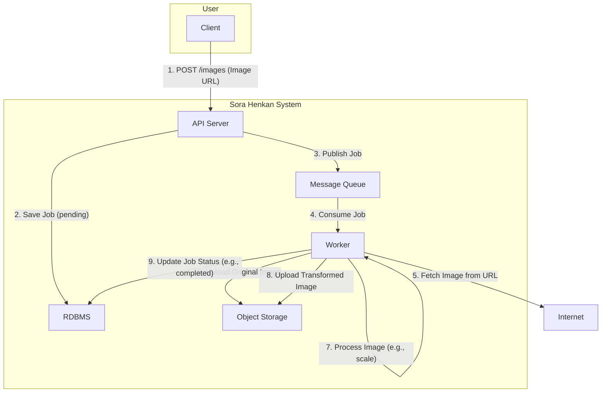
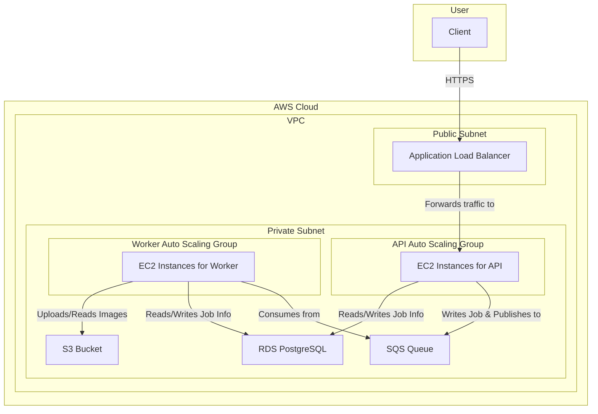

# Sora Henkan (空変換)

Sora Henkan is a powerful and scalable image processing service designed to handle on-the-fly image transformations. It provides a simple API to submit image URLs, apply transformations like scaling, and retrieve the processed images. The system is built with a decoupled architecture using a message queue, ensuring high throughput and resilience.

## Features

- **Asynchronous Image Processing:** Jobs are queued and processed in the background by workers, preventing API blocking.
- **Image Scaling:** Resize images by specifying target width and height.
- **Real-time Updates:** Subscribe to real-time progress updates for image processing jobs via Server-Sent Events (SSE).
- **Cloud-Native:** Designed to run on the cloud with infrastructure-as-code for AWS.
- **Local Development:** A complete Docker Compose setup for easy local development and testing.
- **Observability:** Integrated OpenTelemetry for tracing and metrics with Jaeger for distributed tracing visualization.
- **API Documentation:** Swagger/OpenAPI 3.0 documentation for easy API exploration and testing.
- **Health Monitoring:** Comprehensive health check endpoints for both API and worker services.
- **AMI-Based Deployment:** Fast instance launches using pre-built Amazon Machine Images.
- **Load Testing:** Built-in load testing capabilities for performance validation.
- **CloudWatch Integration:** AWS CloudWatch agent integration for detailed monitoring and logging.
- **CDN Support:** Cloudflare client IP extraction for accurate request tracking behind CDN.

## Architecture

Sora Henkan follows a distributed and decoupled architecture:

### Conceptual Architecture



### AWS Implementation (`simple-aws-architecture`)

This diagram shows how the conceptual architecture is implemented using AWS services as defined in the Terraform configuration.



1.  **API Server (`api`):** A Go server built with the Echo framework. It exposes a RESTful API to accept image processing requests. When a new request is received, it saves the job details to the PostgreSQL database and publishes a message to an SQS queue.
2.  **Worker (`worker`):** A Go application that listens for messages on the SQS queue. When a message is received, it fetches the image from the source URL, performs the required transformations (e.g., scaling) using `libvips`, and uploads the original and transformed images to an S3-compatible object storage.
3.  **Frontend:** A React application (built with Vite) that provides a user interface to interact with the API.
4.  **PostgreSQL:** The primary database for storing information about image processing jobs.
5.  **MinIO/S3:** An object storage service used to store the original and processed images.
6.  **LocalStack/AWS SQS:** A message queue used to decouple the API server from the worker, enabling asynchronous processing.
7.  **Terraform:** Infrastructure as Code (IaC) to provision the necessary AWS resources, including VPC, EC2, RDS, S3, and SQS.
8.  **Jaeger:** Distributed tracing system for monitoring and troubleshooting microservices-based architectures.
9.  **CloudWatch Agent:** AWS monitoring and observability service for collecting metrics and logs from EC2 instances.

## Getting Started

### Prerequisites

-   Go (version 1.21 or higher)
-   Node.js and pnpm
-   Docker and Docker Compose
-   [Task](https://taskfile.dev/installation/)

### Local Development

1.  **Clone the repository:**
    ```sh
    git clone https://github.com/taldoflemis/sora-henkan.git
    cd sora-henkan
    ```

2.  **Start all services:**
    This command will start the API server, worker, frontend, PostgreSQL, MinIO, and LocalStack using Docker Compose.
    ```sh
    task all:up
    ```

3.  **Create the MinIO bucket:**
    You need to create the bucket where images will be stored.
    ```sh
    task minio:create-bucket
    ```

4.  **Run database migrations:**
    This will set up the necessary tables in the PostgreSQL database.
    ```sh
    task migrate:up
    ```

The services will be available at:
-   **Frontend:** `http://localhost:8080`
-   **API Server:** `http://localhost:42069`
-   **API Documentation (Swagger UI):** `http://localhost:42069/swagger/index.html`
-   **MinIO Console:** `http://localhost:9001`

## Technology Stack

-   **Backend:** Go
    -   **Web Framework:** [Echo](https://echo.labstack.com/)
    -   **Messaging:** [Watermill](https://watermill.io/) (with AWS SQS)
    -   **Image Processing:** [govips](https://github.com/davidbyttow/govips)
    -   **Database:** PostgreSQL with [pgx](https://github.com/jackc/pgx)
    -   **Migrations:** [golang-migrate](https://github.com/golang-migrate/migrate)
-   **Frontend:**
    -   **Framework:** React with Vite
    -   **Language:** TypeScript
-   **Infrastructure:**
    -   **Containerization:** Docker, Docker Compose
    -   **IaC:** Terraform
    -   **Cloud:** AWS (EC2, RDS, S3, SQS, ALB, CloudWatch)
    -   **CI/CD:** GitHub Actions (not yet implemented)
-   **Observability:** OpenTelemetry, Jaeger
-   **Load Testing:** k6

## Project Structure

```
.
├── cmd/                # Main applications (api, worker, migrate)
├── deploy/             # Deployment scripts and configurations
├── docker/             # Dockerfiles for different services
├── frontend/           # React frontend application
├── internal/           # Core application logic
│   ├── core/
│   │   ├── application/ # Use cases and business logic
│   │   └── domain/      # Domain entities and types
│   └── infra/           # Infrastructure adapters (database, messaging, etc.)
├── settings/           # Application configuration
└── terraform/          # Terraform code for AWS infrastructure
```

## API Endpoints

-   `POST /v1/images`: Create a new image processing request.
-   `GET /v1/images`: List all image processing jobs.
-   `GET /v1/images/:id`: Get details for a specific image processing job.
-   `GET /v1/images/sse`: Get real-time updates for all jobs.
-   `GET /v1/images/:id/sse`: Get real-time updates for a specific job.
-   `GET /health`: API server health check endpoint.
-   `GET /swagger/*`: Swagger UI for interactive API documentation (OpenAPI 3.0).

### API Documentation

The API is fully documented using OpenAPI 3.0 specification. You can explore and test the API interactively using Swagger UI:

- **Local development:** `http://localhost:42069/swagger/index.html`
- **Regenerate API documentation:** `task swagger:generate`

The OpenAPI specification file is located at `docs/openapi.yaml`.

### Example Request

```sh
curl -X POST http://localhost:42069/v1/images -H "Content-Type: application/json" -d '{
  "image_url": "https://www.nasa.gov/sites/default/files/styles/full_width_feature/public/thumbnails/image/j2m-shareable.jpg",
  "scale_transformation": {
    "enabled": true,
    "width": 200,
    "height": 200
  }
}'
```

## Configuration

The application is configured using YAML files located in the `settings/` directory. The `base.yaml` file contains default settings, which can be overridden by environment-specific files or environment variables.

For example, to change the database host for the API, you can set the `API_DATABASE_HOST` environment variable.

## Load Testing

The project includes a load testing script using k6 located in the `loadgenerator/` directory. This allows you to test the performance and scalability of the image processing service.

To run load tests:

```sh
cd loadgenerator
docker build -t sora-henkan-loadgen .
docker run --rm sora-henkan-loadgen
```

The load test script (`script.js`) includes a set of anime image URLs and simulates realistic user traffic patterns.

## Observability

### Distributed Tracing with Jaeger

The application integrates Jaeger for distributed tracing, allowing you to visualize request flows across the API and worker services. In AWS deployments, Jaeger UI is exposed through the Application Load Balancer.

### CloudWatch Integration

For AWS deployments, the CloudWatch agent collects metrics and logs from EC2 instances, providing comprehensive monitoring and alerting capabilities.

### OpenTelemetry

All services are instrumented with OpenTelemetry for standardized observability, including:
- Request tracing
- Performance metrics
- Custom application metrics

## Deployment

The infrastructure for this project is defined using Terraform in the `terraform/simple-aws-architecture/` directory. The Terraform code provisions all the necessary resources on AWS to run the application in a scalable and resilient manner.

### Key Deployment Features

- **AMI-Based Instances:** Uses pre-built Amazon Machine Images for faster instance launches and consistent deployments
- **Auto Scaling:** Automatic scaling for both API and worker instances based on load
- **Health Checks:** Comprehensive health monitoring for both API and worker services through ALB
- **Application Load Balancer:** Routes traffic to API instances and provides access to Jaeger UI
- **Monitoring:** Integrated CloudWatch agent for metrics and logs collection
- **Optimized Costs:** Instance type optimizations and resource management to reduce AWS costs

## Recent Changes (Since v1.7.0)

### New Features

- **Swagger/OpenAPI 3.0 Documentation** (v1.21.0, v1.22.0): Complete API documentation with interactive Swagger UI
- **Better Orchestration** (v1.22.0): Improved container orchestration and deployment workflows
- **AMI Image Builder** (v1.16.0): Pre-built Amazon Machine Images for faster instance launches and deployments
- **Worker Health Endpoints** (v1.17.0, v1.18.0): Comprehensive health check endpoints for worker services exposed on ALB
- **Load Testing Framework** (v1.15.0): Built-in k6 load testing scripts with anime image dataset
- **Jaeger Integration** (v1.10.0-v1.13.0): Distributed tracing with Jaeger UI accessible through ALB
- **CloudWatch Agent** (v1.13.0): AWS CloudWatch integration for enhanced monitoring and logging
- **Cloudflare Support** (v1.14.0): Client IP extraction for accurate request tracking behind Cloudflare CDN
- **MIME Type Handling** (v1.9.0): Proper MIME type detection and extension mapping for saved images
- **S3 Enhancements** (v1.10.0, v1.11.0): Public bucket access and CORS policy configuration

### Infrastructure Improvements

- **AMI Builder EC2** (v1.16.0): Automated AMI creation for consistent instance deployments
- **Container Resource Limits** (v1.19.0): Proper resource requests and limits for containerized services
- **Cloud-Init Integration** (v1.19.0): Always-run cloud-init scripts for instance configuration
- **Cost Optimizations** (v1.20.0): Reduced costs by removing unnecessary services and optimizing instance types
- **NAT Gateway Sequencing** (v1.20.0): Proper dependency management for OpenTelemetry collector instances

### Bug Fixes and Optimizations

- **OpenTelemetry Logging** (v1.20.0): Removed AWS EMF exporter to reduce costs
- **Load Test Script** (v1.16.2): Updated to use inline URLs for better reliability
- **Instance Scaling** (v1.17.0): Improved handling of worker instance scaling and health checks
- **Docker Compose Optimization** (v1.16.1): Streamlined AMI builder to use docker compose pull

For a complete changelog, see [CHANGELOG.md](CHANGELOG.md).
